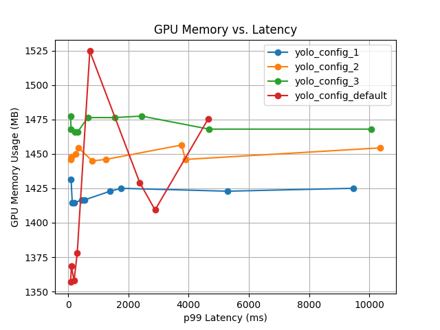
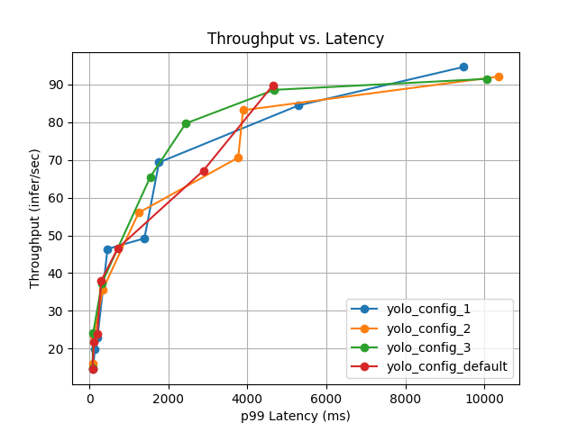

# triton server部署推理服务器
## end2end yolo模型部署
1. export onnx format model, see end2end, and use trtexec in the containor to generate tensorrt plan file
``` shell
# get onnx
python3 export_detection.py \
--weights yolov8s.pt \
--iou-thres 0.65 \
--conf-thres 0.25 \
--topk 100 \
--opset 11 \
--sim \
--input-shape 1 3 640 640 \
--device cuda:0
```

``` shell
# get tensorRT
/usr/src/tensorrt/bin/trtexec \
--onnx=yolov8s.onnx \
--saveEngine=yolov8s.plan \
--fp16
```
2. prepare triton model repository, and pull up triton server
3. use `infer.py` to checkout whether the service is ready or not

## 性能测量
### Installation
```
docker run -it --gpus all -v /var/run/docker.sock:/var/run/docker.sock -v ${PWD}:/models  --net=host nvcr.io/nvidia/tritonserver:24.09-py3
# 最新版本triton-model-analyzer依赖glibc2.38，glibcxx3.4.32，之前triton容器没有对应版本需要手动源码编译安装
pip3 install triton-model-analyzer==1.44.0 -i https://pypi.tuna.tsinghua.edu.cn/simple
```

### Analyze
```
# see https://github.com/triton-inference-server/model_analyzer/blob/main/docs/install.md#recommended-installation-method for detail
model-analyzer profile --model-repository /models/model_repository --profile-models yolo --triton-launch-mode=local --override-output-model-repository
# user giude
# https://github.com/triton-inference-server/model_analyzer/blob/main/docs/README.md
```

### detail report



### Optimization Option
上面 model_analyzer 在帮我们测量性能的时候，会尝试搜索不同配置下的性能。影响性能的选项有哪些呢？
- Instance Group，每个设备上使用多少个模型实例。模型实例占内存，但可以提高利用率
- Dynamic Batching，是否开启 batching。将请求积攒到一定数量后，再做推理。
- Preferred Batch Sizes，可以设置不同的数值，在一定的排队时间内，如果达到了其中一个数值，就马上做请求，而不用等待其他请求。
- Model Rate Limiter，约束模型的执行。
- Model Queue Policy，排队时间等待策略。
- Model Warmup，避免第一次启动的延迟。
- Model Response Cache，这是最近增加的特性，是否开启缓存。如果遇到了相同的请求，就会使用缓存。

### Optimization Metrics
Serving 在不同的场景，需要不同的优化目标。目标是多个的，复杂的，并不是那么的单一。大家都想最小化延迟的同时，又要最大化吞吐。目标严重依赖于应用场景，因此只有确立目标，才可以往那个方向尽可能的优化。
- 延迟
- 吞吐
- GPU 利用率
- GPU 内存占用
- GPU 功耗
- 业务相关的指标：比如在尽可能少的设备上放尽可能多的模型

## Note
```
problem:
`"IRuntime::deserializeCudaEngine: Error Code 1: Serialization (Serialization assertion safeVersionRead == kSAFE_SERIALIZATION_VERSION failed.Version tag does not match.`
solution:
use trtexec in the containor to generate tensorrt plan
# remember use --gpus to create
docker run -it --rm --gpus all -v ${PWD}:/models nvcr.io/nvidia/tritonserver:24.09-py3
```